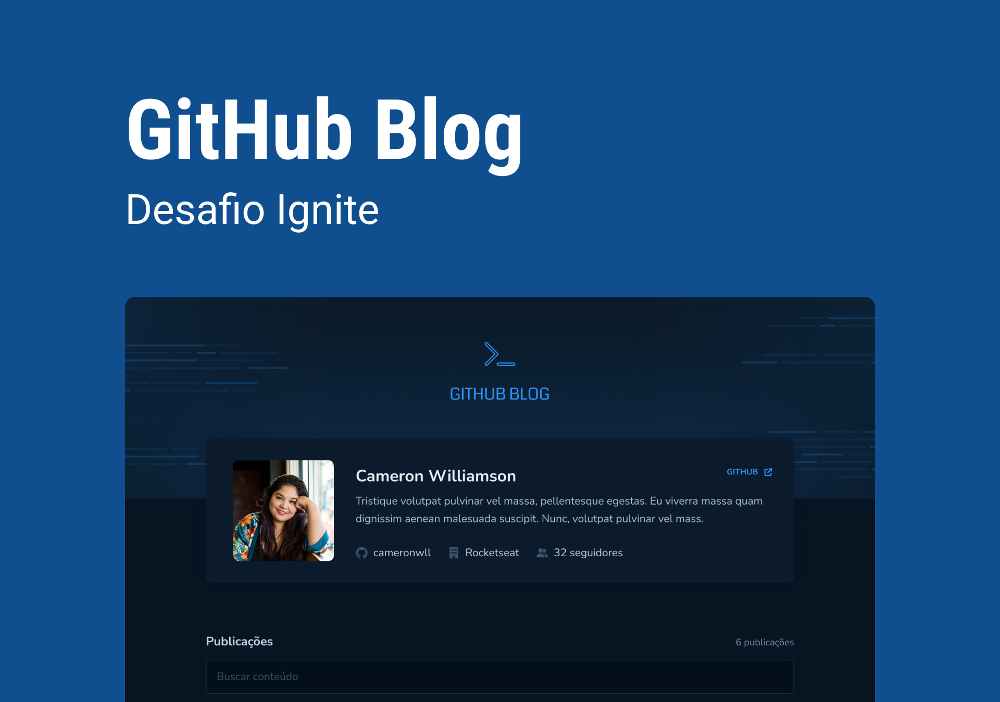

<div align='center'>
  
</div>

<h1 align='center'>
Github Blog
</h1>

<h4 align='center'>
Desafio 3 - Ignite 2022 🚀
</h4>

 # 💻 Projeto

Blog pessoal com informações consultados da API do GITHUB, onde é listado os posts cadastrados nas issues do repositório sendo possível visualizar detalhadamente um post especifico.

A aplicação foi desenvolvida com React + Typescript e como desafio do módulo 3 do bootcamp Ignite - 2022. Neste projeto foi aplicado diversos conhecimentos visto no módulo como: Fetch / Axios, rotas, formulários com React-Hook-Form, hooks (useState, useEffect e useCallback), além dos fundamentos básicos da ferramenta como por exemplo a componentização.

O Projeto também foi desenvolvido do total zero, apenas seguindo o layout proposto na plataforma do Figma, seguindo arrisca todos os paramentros de cores, tamanho das fontes, espaçamento e estados em que cada elemento possa assumir na aplicação, além de, ter sido incluído alguns elementos a mais, como responsividade a fim de enriquecer o projeto.
 
 # 🧪 Tecnologias

Esse projeto foi desenvolvido com as seguintes principais tecnologias:
- [ReactJS](https://pt-br.reactjs.org/);
- [ViteJS](https://vitejs.dev/);
- [Typescript](https://www.typescriptlang.org/);
- [Context API](https://pt-br.reactjs.org/docs/context.html);
- [React Router Dom](https://v5.reactrouter.com/web/guides/quick-start);
- [React Hook Form](https://react-hook-form.com/);
- [Styled Components](https://styled-components.com/);
- [Zod](https://github.com/colinhacks/zod);

# 🚀 Como executar

Clone o projeto e acesse a pasta do mesmo.

```bash
$ git clone https://github.com/MarcosMDev/github-blog
$ cd github-blog
```
Para iniciá-lo, siga os passos abaixo:
```bash
# Instalar as dependências
$ npm install
# Iniciar o projeto
$ npm start
```
O app estará disponível no seu browser pelo endereço http://localhost:5173.

# 🎨 Layout
Você pode visualizar o layout do projeto através do link abaixo:
- [Layout Web](https://www.figma.com/file/8TcMUD9IMgfs15sueQO564/GitHub-Blog-(Community)?node-id=2%3A1550&t=H7Va6raWKBL8ipHx-1) (Lembrando que você precisa ter uma conta no Figma).

# 📃 License
[MIT](https://choosealicense.com/licenses/mit/)